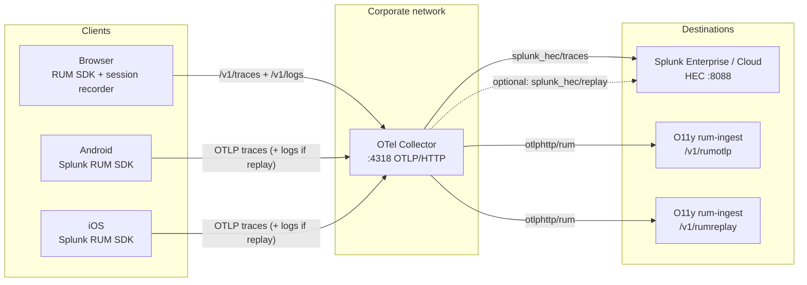

# Send RUM data via OTel Collector to Splunk Observability and Enterprise/Cloud

This is an **example** of routing RUM data through an **OpenTelemetry Collector** to **Splunk Observability Cloud** and **Splunk Cloud / Enterprise** (via HEC). Putting a collector on a stable internal endpoint is useful when client networks are unreliable, egress to Splunk is restricted, or you want one controlled hop for TLS, fan-out, and secrets.

This walkthrough does **not** enable collector-side persistence or offline buffering. If devices or links are often disconnected, review [Data Persistence in the OpenTelemetry Collector](https://community.splunk.com/t5/Community-Blog/Data-Persistence-in-the-OpenTelemetry-Collector/ba-p/624583) for queue and storage options—you can apply those patterns on top of the routing shown here without changing the client instrumentation below.

Send browser and mobile RUM through the collector. It receives OTLP from clients and forwards data to Splunk in two logical streams:

| Data | Default destinations | Notes |
|------|----------------------|--------|
| **RUM traces** (page loads, errors, user actions) | **Splunk Enterprise / Cloud** (HEC) **and** **Splunk Observability Cloud** | Dual export is the typical pattern for long-term search in Enterprise plus RUM UI in O11y. |
| **Session replay** (OTLP logs from the session recorder) | **Splunk Observability Cloud only** (`rumreplay`) | Replay is built for the O11y RUM experience. Optionally mirror replay into Enterprise for longer retention or custom analytics — see [Optional: session replay in Splunk Enterprise / Cloud](#optional-session-replay-in-splunk-enterprise). |

Secrets (HEC token, RUM access token) live on the collector, not in public client bundles when you use the `headers_setter` pattern below.

**Local stack:** To validate or tune this config on a laptop, use [README.md](./README.md) (`docker-compose.yml`, `test-page/index.html`).

---

## Architecture



Clients POST to the collector’s **OTLP HTTP receiver** paths (`/v1/traces`, `/v1/logs`). The collector POSTs to Splunk O11y on **`/v1/rumotlp`** (traces) and **`/v1/rumreplay`** (replay). Do not point browsers at `rum-ingest.*` directly unless you intentionally bypass the collector.

---

## 1. RUM instrumentation

Point all clients at your collector—not at `rum-ingest.*`—unless you deliberately bypass the collector.

### 1a. Browser (Web)

Load RUM v3 from the Splunk CDN (or self-host the same bundles). Initialise the main SDK and session recorder with **collector OTLP HTTP paths**.

```html
<script src="https://cdn.observability.splunkcloud.com/o11y-gdi-rum/v3/splunk-otel-web.js" crossorigin="anonymous"></script>
<script src="https://cdn.observability.splunkcloud.com/o11y-gdi-rum/v3/splunk-otel-web-session-recorder.js" crossorigin="anonymous"></script>
<script>
  SplunkRum.init({
    applicationName: 'my-app',
    deploymentEnvironment: 'production',
    version: '1.0.0',
    rumAccessToken: 'YOUR_RUM_TOKEN',  // forwarded as X-SF-Token when present
    beaconEndpoint: 'https://otelcollector.internal.example.com/v1/traces',
    exporter: { otlp: true },
  });

  SplunkSessionRecorder.init({ 
    rumAccessToken: 'YOUR_RUM_TOKEN',
    beaconEndpoint: 'https://otelcollector.internal.example.com/v1/logs',
    recorder: 'splunk',
  });
</script>
```

| SDK | `beaconEndpoint` | Collector receives | Collector exports to |
|-----|------------------|--------------------|----------------------|
| `SplunkRum` | `https://<collector>/v1/traces` | OTLP traces | `https://rum-ingest.${env:SPLUNK_REALM}.observability.splunkcloud.com/v1/rumotlp` |
| `SplunkSessionRecorder` | `https://<collector>/v1/logs` | OTLP logs (replay payload) | `https://rum-ingest.${env:SPLUNK_REALM}.observability.splunkcloud.com/v1/rumreplay` |

**CORS:** Session replay sends **gzip** bodies; allow your app origins and headers (including `X-SF-Token`) on the OTLP HTTP receiver — see the collector snippet below.

### 1b. Android

Add the dependency in `build.gradle`:

```gradle
implementation 'com.splunk:splunk-otel-android:+'
```

Initialise in `Application.onCreate()`. Set `beaconEndpoint` to the collector OTLP HTTP base URL (append `/v1/traces` if required by your SDK version):

```kotlin
import com.splunk.rum.SplunkRum

SplunkRum.builder()
    .setApplicationName("my-app")
    .setDeploymentEnvironment("production")
    .setRumAccessToken("YOUR_RUM_TOKEN")   // optional if collector sets X-SF-Token from env
    .setBeaconEndpoint("https://otelcollector.internal.example.com/v1/traces")
    .build(this)
```

Ensure the collector hostname resolves on the device (corporate DNS or MDM) and that the device trusts the collector TLS certificate (corporate CA in the trust store).

### 1c. iOS (Swift)

Add the package in Xcode (**File → Add Packages**):

```
https://github.com/signalfx/splunk-otel-ios
```

Initialise in `AppDelegate.application(_:didFinishLaunchingWithOptions:)`:

```swift
import SplunkOtel

SplunkRum.initialize(
    beaconUrl: "https://otelcollector.internal.example.com/v1/traces",
    rumAuth: "YOUR_RUM_TOKEN",           // optional if collector sets X-SF-Token from env
    options: SplunkRumOptions(
        appName: "my-app",
        deploymentEnvironment: "production"
    )
)
```

Ensure `otelcollector.internal.example.com` is reachable and the corporate CA is trusted on the device (MDM profile). Session replay on mobile, if enabled, should send OTLP logs to the collector’s `/v1/logs` path—the same pipeline as the browser recorder in section 1a.

---

## 2. OTel Collector configuration

Run the [Splunk Distribution of OpenTelemetry Collector](https://github.com/signalfx/splunk-otel-collector) on a VM reachable from clients and from Splunk HEC / the public O11y ingest endpoints.

This matches the tested layout in [`otel-collector-config.yaml`](./otel-collector-config.yaml). Replace hostnames, TLS paths, and index names for your environment.

```yaml
extensions:
  headers_setter:
    headers:
      - action: upsert
        key: X-SF-Token
        from_context: X-SF-Token
        default_value: "${env:SPLUNK_RUM_ACCESS_TOKEN}"
  health_check:
    endpoint: 0.0.0.0:13133

receivers:
  otlp:
    protocols:
      http:
        endpoint: 0.0.0.0:4318
        tls:
          cert_file: /etc/otelcol/tls/server.crt
          key_file: /etc/otelcol/tls/server.key
        cors:
          allowed_origins:
            - "https://my-app.example.com"
            - "https://*.internal.example.com"
          allowed_headers:
            - "*"
      grpc:
        endpoint: 0.0.0.0:4317
        tls:
          cert_file: /etc/otelcol/tls/server.crt
          key_file: /etc/otelcol/tls/server.key

processors:
  memory_limiter:
    check_interval: 2s
    limit_mib: 1500
  batch:
    send_batch_size: 2048
    timeout: 10s
    metadata_keys:
      - X-SF-Token
  # Only needed if you export session replay to Enterprise HEC (optional block below).
  resource/replay_hec:
    attributes:
      - key: com.splunk.signalfx.access_token
        action: delete
      - key: com.splunk.index
        action: delete
      - key: com.splunk.source
        action: delete
      - key: com.splunk.sourcetype
        action: delete

exporters:
  otlphttp/rum:
    traces_endpoint: "https://rum-ingest.${env:SPLUNK_REALM}.observability.splunkcloud.com/v1/rumotlp"
    logs_endpoint: "https://rum-ingest.${env:SPLUNK_REALM}.observability.splunkcloud.com/v1/rumreplay"
    compression: gzip
    headers:
      X-SF-Token: "${env:SPLUNK_RUM_ACCESS_TOKEN}"
    auth:
      authenticator: headers_setter

  splunk_hec/traces:
    token: "${env:SPLUNK_HEC_TOKEN}"
    endpoint: "https://splunk-hec.internal.example.com:8088/services/collector"
    source: rum
    sourcetype: otel
    index: main
    profiling_data_enabled: false
    timeout: 30s
    tls:
      insecure_skip_verify: false

service:
  extensions: [headers_setter, health_check]
  pipelines:
    traces:
      receivers: [otlp]
      processors: [memory_limiter, batch]
      exporters: [otlphttp/rum, splunk_hec/traces]
    logs:
      receivers: [otlp]
      processors: [memory_limiter, batch]
      exporters: [otlphttp/rum]
```

Environment variables (secrets manager in production):

```bash
export SPLUNK_HEC_TOKEN="<hec-token>"
export SPLUNK_REALM="<realm>"
export SPLUNK_RUM_ACCESS_TOKEN="<rum-token>"
```

### Optional: session replay in Splunk Enterprise / Cloud

To **also** land replay in Enterprise (e.g. longer retention, SIEM correlation), add the structured HEC exporter and include it on the **logs** pipeline. Keep `resource/replay_hec` so RUM OTLP metadata does not override your HEC index or token.

```yaml
  splunk_hec/replay:
    token: "${env:SPLUNK_HEC_TOKEN}"
    endpoint: "https://splunk-hec.internal.example.com:8088/services/collector"
    source: rum-replay
    sourcetype: otel:rum-replay
    index: main
    log_data_enabled: true
    profiling_data_enabled: false
    timeout: 30s
    tls:
      insecure_skip_verify: false
```

```yaml
    logs:
      receivers: [otlp]
      processors: [memory_limiter, resource/replay_hec, batch]
      exporters: [otlphttp/rum, splunk_hec/replay]
```

Example search after replay is enabled:

```spl
index=main sourcetype=otel:rum-replay source=rum-replay earliest=-15m
| stats count by events{}.name
```

Replay events in Enterprise use HEC ingest time for `_time`; timestamps inside the JSON body are often session-relative — see [README.md](./README.md) troubleshooting if you compare wall-clock to payload fields.

### Firewall

| Source | Destination | Port | Purpose |
|--------|-------------|------|---------|
| Clients / VPN | Collector | 4318 (HTTPS) | OTLP HTTP |
| Collector | Splunk HEC | 8088 (HTTPS) | Traces (+ optional replay) |
| Collector | `rum-ingest.<realm>.observability.splunkcloud.com` | 443 | `/v1/rumotlp`, `/v1/rumreplay` |

### VM sizing (starting point)

| Concurrent clients | vCPU | RAM |
|--------------------|------|-----|
| ~500 | 2 | 2 GB |
| ~2 000 | 4 | 4 GB |
| ~10 000 | 8 | 8 GB |

Tune `memory_limiter.limit_mib` to ~75% of available RAM.

---

## 3. Splunk Enterprise / Cloud (HEC)

Coordinate with your Splunk admin:

- **Index** — dedicated index (e.g. `rum`) or `main` as in the example; token must be allowed to write to it.
- **Traces** — `source=rum`, `sourcetype=otel` (OTLP via HEC).
- **Replay (optional)** — `source=rum-replay`, `sourcetype=otel:rum-replay`, structured JSON from the HEC log exporter.

Example trace search:

```spl
index=main sourcetype=otel source=rum earliest=-15m
| stats count by name
```

---

## 4. Validation

**Collector health**

```bash
curl -s https://otelcollector.internal.example.com:13133/
```

**Splunk Observability Cloud** — RUM → your application; traces and replay sessions within ~30s of traffic.

**Splunk Enterprise / Cloud** — trace counts in `index=main sourcetype=otel source=rum` (adjust index if you changed it).

For step-by-step local checks (Network tab, `docker compose logs`, CORS/gzip notes), use [README.md](./README.md).

---

## Troubleshooting

| Symptom | Likely cause | Fix |
|---------|----------------|-----|
| CORS on `/v1/logs` | Replay uses gzip; strict `allowed_headers` | Use `allowed_headers: ["*"]` (or include `content-type`, `content-encoding`, `X-SF-Token`) |
| iOS/Android: SSL handshake failure | Corporate CA not trusted on device | Deploy CA via MDM; or configure collector/HEC `ca_file` with your corporate bundle |
| Replay in O11y, not in Enterprise | Default logs pipeline only exports to O11y | Add `splunk_hec/replay` and `resource/replay_hec` (optional section); search **All time** if replay `_time` looks off |
| HEC 400 / wrong index | RUM attrs on OTLP logs | Ensure `resource/replay_hec` when using Enterprise replay exporter |
| No O11y replay | Wrong ingest path | Collector must use **`/v1/rumreplay`**, not `/v1/logs`, on `rum-ingest.*` |
| Browser must not call `rum-ingest` | Bypassing collector | Use `/v1/traces` and `/v1/logs` on the collector only |
