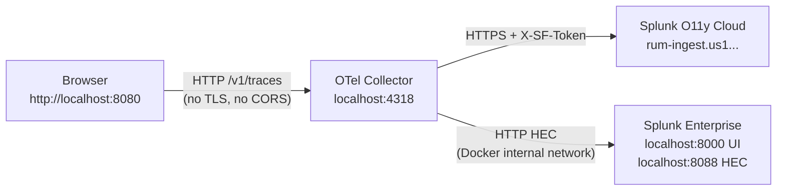

# RUM via OTel Collector — Local Test Stack

A fully local Docker Compose setup for testing the RUM → OTel Collector → Splunk pipeline on your laptop.  
No TLS certificates, no CORS fights, no public website dependency.

**Production / scale-out example** (TLS, corporate network, default vs optional Enterprise replay): [README-SCALE.md](./README-SCALE.md).

This repo’s reference collector config is [`otel-collector-config.yaml`](./otel-collector-config.yaml); the test page is [`test-page/index.html`](./test-page/index.html).

## Architecture



## Prerequisites

- Docker Desktop (or Docker Engine + Compose plugin)
- Python 3 (for the local HTTP server) — or any static file server
- A Splunk Observability Cloud account with a RUM access token

## Quickstart

### 1. Configure credentials

```bash
cp .env.example .env
```

Edit `.env` and fill in:

| Variable | Where to get it |
|---|---|
| `SPLUNK_REALM` | Org Settings → Overview (e.g. `us1`) |
| `SPLUNK_ACCESS_TOKEN` | Org Settings → Access Tokens → any Ingest token |
| `SPLUNK_RUM_ACCESS_TOKEN` | Org Settings → Access Tokens → type **RUM** |
| `SPLUNK_HEC_TOKEN` | Make up any UUID: `python3 -c "import uuid; print(uuid.uuid4())"` |
| `SPLUNK_LOCAL_PASSWORD` | Any password ≥8 chars for the local Splunk UI |

### 2. Update the test page token

Open `test-page/index.html` and replace `PASTE_YOUR_RUM_ACCESS_TOKEN_HERE` with your RUM token.

### 3. Start the stack

```bash
docker compose up -d
```

Splunk Enterprise takes ~60–90 seconds to fully start. Watch progress:

```bash
docker compose logs -f splunk
# Ready when you see: "Ansible playbook complete"
```

### 4. Serve the test page

```bash
python3 -m http.server 8080 --directory test-page
```

### 5. Generate spans

Open `http://localhost:8080` in your browser and click the buttons.  
Watch the **Network** tab — you should see `POST localhost:4318/v1/traces` returning 200.

### After editing `test-page/index.html`

The test page is **not** run by Docker Compose — it is only files on disk served by the Python command in step 4.

| What you changed | What to do |
|---|---|
| `test-page/index.html` only (RUM token, `beaconEndpoint`, buttons, etc.) | Save the file. If step 4’s server is still running, **reload** `http://localhost:8080` (hard refresh: **Cmd+Shift+R** / **Ctrl+Shift+R** so the browser does not use a cached copy). No `docker compose` restart. |
| Step 4 server not running | Start it again: `python3 -m http.server 8080 --directory test-page` |
| `.env` (realm, tokens, Splunk password) | `docker compose up -d` so containers pick up new env vars |
| `otel-collector-config.yaml` | `docker compose restart otelcol` (see below) |

## Validation

### OTel Collector health
```bash
curl -s http://localhost:13133/ | python3 -m json.tool
```
Expect `"status": "Server available"`.

### Splunk O11y Cloud RUM UI
1. Open [Splunk Observability Cloud](https://app.us1.signalfx.com) → **RUM**
2. Select application `local-rum-test`
3. Sessions and page loads should appear within ~30 seconds

### Local Splunk Enterprise
1. Open `http://localhost:8000` → log in as `admin` / `<SPLUNK_LOCAL_PASSWORD>`
2. Go to **Search & Reporting** and run:
   ```spl
   index=main sourcetype=otel earliest=-5m
   | stats count by source
   ```
   RUM **traces** use `source=rum`; **session replay** logs use `source=rum-replay` (same `index=main`).

   Example replay search (generate new replay after collector restart):
   ```spl
   index=main sourcetype=otel:rum-replay source=rum-replay earliest=-15m
   | stats count by events{}.name
   ```
   **Timestamps:** Splunk **`_time`** on these events is the OTLP log record time the HEC exporter sends (nanoseconds → epoch seconds), usually close to **when the batch was exported**, not rr-web’s per-action clock inside the JSON body. Nested fields such as `events{}.timestamp` are often **milliseconds within the session** and will not match `_time` if you expect wall-clock replay timing. Search with `earliest=-15m` around your test; compare `_time` to `events{}.timestamp` in the same row. Do not point a custom sourcetype `TIME_PREFIX` at fields inside the replay payload unless you know their format—misconfigured `props.conf` makes `_time` look wrong even when ingest is fine.

   If replay is missing from `index=main`, check other indexes (RUM can set `com.splunk.index` on OTLP logs):
   ```spl
   index=* sourcetype=otel earliest=-15m
   | search enterprise-replay-fix-test OR mouse-move OR segmentMetadata
   | stats count by index, source
   ```

### Collector logs
```bash
docker compose logs -f otelcol
```
Look for `"kind": "exporter"` lines confirming successful export to both destinations.

### If made changes to `otel-collector-config.yaml`
```bash
docker compose restart otelcol
```


## Stopping the stack

```bash
docker compose down          # stop containers, keep Splunk data volume
docker compose down -v       # stop containers AND delete Splunk data
```

## Troubleshooting

| Symptom | Check |
|---|---|
| Browser console: `net::ERR_CONNECTION_REFUSED` on port 4318 | `docker compose ps` — is `otelcol` running? |
| Collector starts then exits immediately | `docker compose logs otelcol` — likely a YAML syntax error in the config |
| No data in O11y Cloud RUM UI | Confirm `SPLUNK_RUM_ACCESS_TOKEN` is a **RUM** token, not ingest |
| HEC 401 in collector logs | Confirm `SPLUNK_HEC_TOKEN` in `.env` matches what Splunk received at startup |
| Splunk container unhealthy / restarting | Password too short or doesn't meet complexity — update `.env` and `docker compose up -d` |
| CORS error in browser console | Collector not running, page served via `file://`, or missing `allowed_headers` (e.g. `X-SF-Token` on session replay) — use `python3 -m http.server` and see `otel-collector-config.yaml` cors section |
| Session replay CORS on `/v1/logs` | Replay POSTs use **gzip** (`Content-Encoding: gzip`). Preflight asks for `content-type,content-encoding`; a partial `allowed_headers` list can still fail — use `allowed_headers: ["*"]` under `cors`, then `docker compose restart otelcol` |
| Session replay works in O11y but not Enterprise | Not a JSON-vs-OTLP issue: HEC gets **structured JSON** from the exporter. Check RUM attrs `com.splunk.index` / `com.splunk.signalfx.access_token` (strip via `resource/replay_hec`). Search `index=main sourcetype=otel:rum-replay source=rum-replay` and `index=* sourcetype=otel* earliest=-1h \| stats count by index, sourcetype, source`. |
| `otlphttp/rum` logs HTTP 400 | Usually a bad/test OTLP payload to `rumreplay`; browser replay can still work. Does not block HEC. Ignore unless O11y replay breaks too. |
| Replay in Enterprise but `_time` looks wrong | HEC `_time` ≠ rr-web event time in the body; use recent `earliest`/`latest` for ingest time. For analysis, `| eval replay_ts=events{}.timestamp` (or spath) and treat units as session-relative unless documented otherwise. |

## File overview

```
rum-via-otel-collector-local/
├── docker-compose.yml           # otelcol + splunk/splunk:latest
├── otel-collector-config.yaml   # OTLP receiver (CORS enabled) + dual exporters
├── .env.example                 # Credential template — copy to .env
├── .gitignore                   # Excludes .env from git
└── test-page/
    └── index.html               # Browser RUM test page with @splunk/otel-web v3
```
